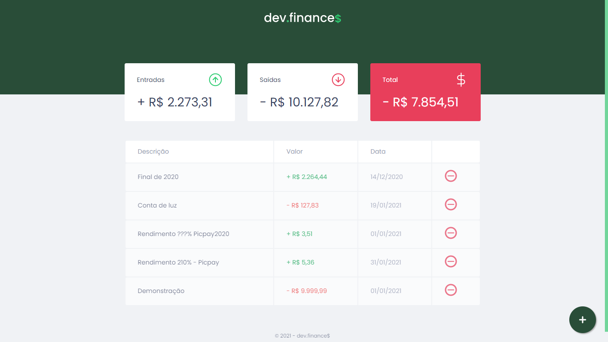
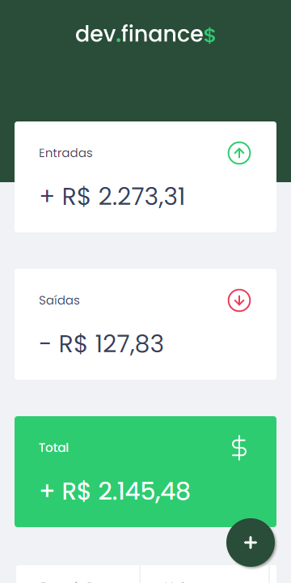
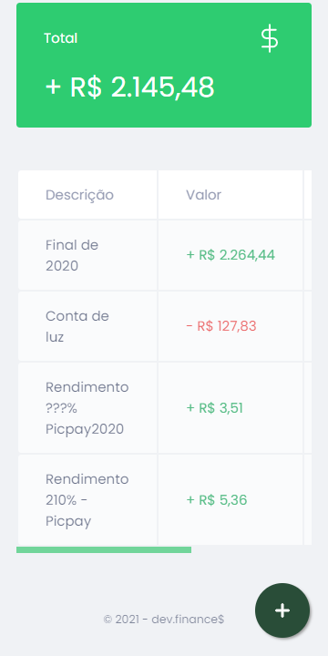
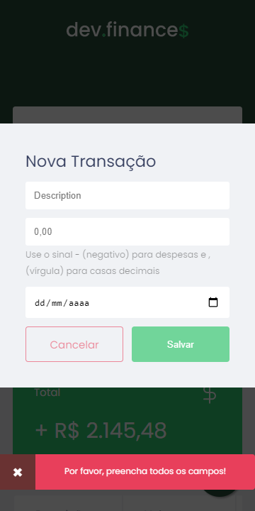

<h1 align="center">
  <br>
    
</h1>
<p align="center">
    
    <a href="https://github.com/danielusi/maratona-discover/blob/main/LICENSE">
        
    </a>
</p>

# Dev.Finance💲
Projeto desenvolvido para administrar melhor ganhos e gastos. Realizado na #MaratonaDiscover com a @Rocketseat🚀. Dev.Finance$

#### Funcionalidades
* Site para administrar ganhos e gastos (controle financeiro).
* Cadastro e exclusão de transações.
* Visualização do saldo de entrada e saída.
* Float Button.
* Scrollbar personalizado.
* Toast de erro - (Modal).
* Mudança de cor no Card 'total' - (+$0,00 verde ↑ e -$0,01 vermelho ↓).

## Tecnologias 🚀
Esse projeto foi desenvolvido com as seguintes tecnologias:

- [HTML](https://pt.wikipedia.org/wiki/HTML)
- [CSS](https://pt.wikipedia.org/wiki/Cascading_Style_Sheets)
- [JavaScript](https://pt.wikipedia.org/wiki/JavaScript)

## Layout 📺︎
#### Desktop Screenshot
<div style="display: flex; flex-direction: 'column'; align-items: 'center';">
<!-- Responsive, 1440 x 900, 50% (Laptop L - 1440px)-->
    
    
</div>

#### Mobile Screenshot
<div style="display: flex; flex-direction: 'row';">
<!-- Responsive, 425 x 900, 60% (Mobile L - 425px)-->
    
    
    
    
</div>

## Rodando o projeto 🚴🏻‍

```bash

# Clone o repositório
$ git clone https://github.com/danielusi/maratona-discover.git

# Acesse a pasta do projeto no prompt de comando
$ cd maratona-discover

# Abra o projeto com o navegador de sua preferência
$ index.html
```

## Contribuição 💭
Com a ajuda do professor ***Mayk Brito*** da equipe Rockeatset consegui desenvolver esta aplicação.
Feito com ♥ by Rocketseat :wave: [Participe da nossa comunidade!](https://discord.gg/YxU7fJT)

## Contato ✉️

LinkedIn:
https://www.linkedin.com/in/danielbenicio/">
        
Email:
danielbenicio123@gmail.com
